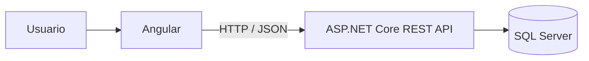
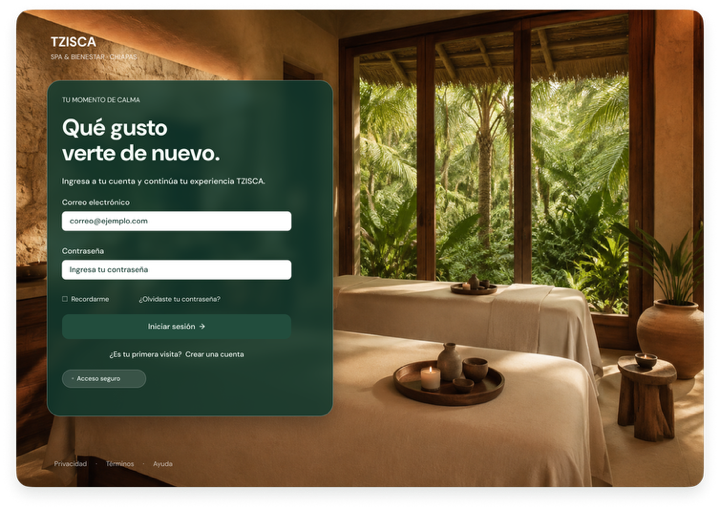
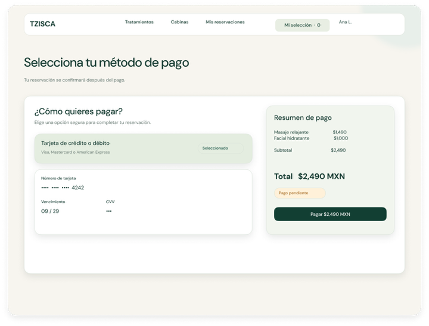
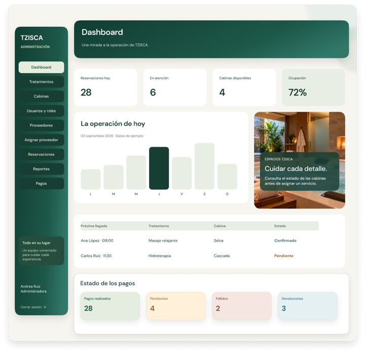
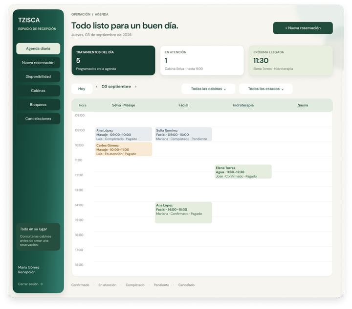
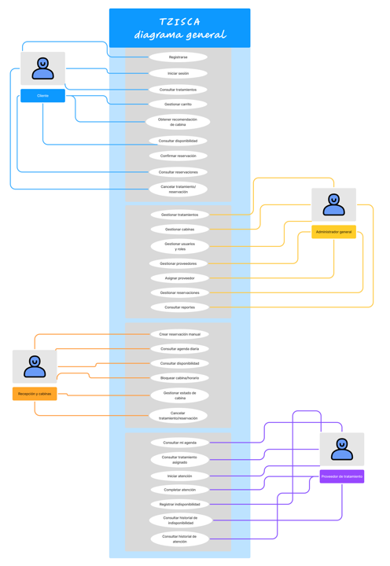
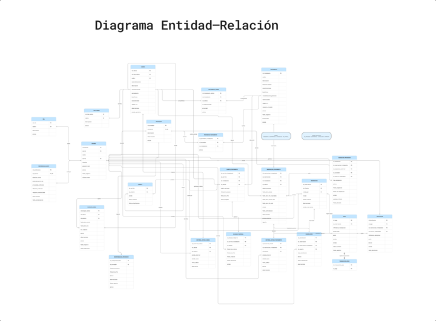
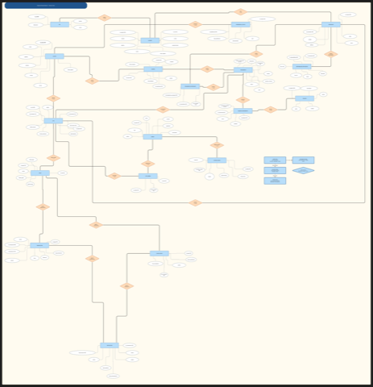

# TZISCA


**Proyecto académico · Diseño y documentación · Implementación pendiente (modelo vigente de 19 entidades)**

[Documentación](docs/README.md) · [Diagramas](docs/diagramas/README.md) · [Vistas por rol](docs/vistas/README.md) · [Sprint 1](docs/planificacion/sprint-1.md)

Sistema Web de Reservas, Recomendación y Gestión de Cabinas para Spa.

TZISCA centraliza el catálogo de tratamientos, cabinas, disponibilidad, citas, proveedores, pagos, devoluciones y operación general del spa en una sola plataforma.

---

## Arquitectura

Frontend: Angular  
Backend: ASP.NET Core REST API  
Base de datos: SQL Server



[Ver diagrama de arquitectura](docs/diagramas/arquitectura.md).

---

## Funcionalidades principales

Alcance documentado, pendiente de implementación.

- Registro e inicio de sesión.
- Control de acceso por roles.
- Catálogo de tratamientos.
- Catálogo de cabinas.
- Compatibilidad tratamiento-cabina.
- Recomendación de cabinas.
- Carrito de citas.
- Consulta de disponibilidad.
- Bloqueos temporales.
- Citas.
- Gestión de proveedores.
- Asignación y sustitución de proveedores.
- Pagos.
- Devoluciones.
- Cancelaciones.
- Historial y trazabilidad.
- Reportes básicos.

---

## Roles del sistema

| Rol | Función principal |
|---|---|
| Cliente | Consulta servicios, gestiona carrito, agenda, paga y consulta sus citas |
| Administrador general | Administra usuarios, tratamientos, cabinas, proveedores, pagos, devoluciones y reportes |
| Recepción y cabinas | Gestiona agenda, disponibilidad, citas manuales, bloqueos y cancelaciones |
| Proveedor de tratamiento | Consulta su agenda, registra indisponibilidad e inicia o completa atenciones |

---

## Flujo principal de citas

Login → Catálogo → Detalle → Carrito → Número de personas → Recomendación de cabina → Selección de cabina → Fecha y hora → Validación de disponibilidad → Bloqueo temporal → Resumen → Cita `PENDIENTE` → Pago → Revalidación → Confirmación → Mis citas

[Ver flujo en Mermaid](docs/diagramas/flujo-citas.md). Cada tratamiento seleccionado genera una Cita `PENDIENTE`; la confirmación requiere el pago válido cuando corresponda y la disponibilidad revalidada.

---

## Tecnologías

| Área | Tecnología |
|---|---|
| Frontend | Angular |
| Backend | ASP.NET Core |
| API | REST / JSON |
| Base de datos | SQL Server |
| Control de versiones | Git / GitHub |

---

## Documentación

[Índice general de documentación](docs/README.md).

### General

- [Propuesta del proyecto](docs/propuesta/propuesta-proyecto.md)
- [Arquitectura general](docs/arquitectura/arquitectura-general.md)
- [Catálogo de cabinas](docs/catalogos/catalogo-cabinas.md)

### Funcional

- [Casos de uso](docs/casos-de-uso/casos-de-uso.md)
- [Criterios de aceptación](docs/criterios-aceptacion/criterios-aceptacion.md)
- [Reglas de negocio](docs/reglas-negocio/reglas-negocio.md)

### Técnica

- [Diseño de API REST](docs/api/diseno-api-rest.md)
- [Diccionario de datos](docs/modelo-datos/diccionario-datos.md)
- [Diagramas](docs/diagramas/README.md)
- [Vistas](docs/vistas/README.md)

### Planificación

- [Sprint 1](docs/planificacion/sprint-1.md)

---

## Estructura del repositorio

```text
TZISCA/
├── backend/
├── frontend/
├── database/
│   ├── migrations/
│   ├── scripts/
│   └── seed/
├── docs/
│   ├── propuesta/
│   ├── planificacion/
│   ├── catalogos/
│   ├── arquitectura/
│   ├── api/
│   ├── casos-de-uso/
│   ├── criterios-aceptacion/
│   ├── reglas-negocio/
│   ├── modelo-datos/
│   ├── diagramas/
│   ├── vistas/
│   │   ├── cliente/
│   │   ├── administrador/
│   │   ├── recepcion/
│   │   └── proveedor/
│   ├── screenshots/
│   │   └── thumbs/
│   └── assets/
├── tests/
├── README.md
└── .gitignore
```

`fuentes/` y `respaldo-md/` se conservan localmente y están ignoradas por Git.

## Galería visual

Muestra representativa de las vistas documentadas, no el inventario completo. La documentación incluye **73 pantallas y variantes de Figma V3** y **15 diagramas del FigJam**. Las interfaces son prototipos; las capturas de una aplicación implementada siguen pendientes.

- [Inventario de vistas por rol](docs/vistas/README.md).
- [Convención de capturas y miniaturas](docs/screenshots/README.md).
- [Origen y nodos de las interfaces](docs/vistas/origen-figma.md).
- [Origen y nodos de los diagramas](docs/diagramas/origen-figma.md).

### Cliente

<table>
<tr>
<td align="center">
<a href="docs/vistas/cliente/cliente-login.png">

<br>Login
</a>
</td>
<td align="center">
<a href="docs/vistas/cliente/cliente-catalogo.png">

<br>Catálogo
</a>
</td>
<td align="center">
<a href="docs/vistas/cliente/cliente-pago.png">

<br>Pago
</a>
</td>
</tr>
</table>

[Ver todas las vistas de Cliente](docs/vistas/cliente/README.md)

### Administrador

<table>
<tr>
<td align="center">
<a href="docs/vistas/administrador/admin-dashboard.png">

<br>Dashboard
</a>
</td>
</tr>
</table>

[Ver todas las vistas de Administrador general](docs/vistas/administrador/README.md)

### Recepción

<table>
<tr>
<td align="center">
<a href="docs/vistas/recepcion/recepcion-agenda-diaria.png">

<br>Agenda diaria
</a>
</td>
</tr>
</table>

[Ver todas las vistas de Recepción y cabinas](docs/vistas/recepcion/README.md)

### Proveedor

<table>
<tr>
<td align="center">
<a href="docs/vistas/proveedor/proveedor-agenda.png">

<br>Mi agenda
</a>
</td>
</tr>
</table>

[Ver todas las vistas de Proveedor de tratamiento](docs/vistas/proveedor/README.md)

## Diagramas de casos de uso

Muestra representativa. Los quince diagramas exportados del FigJam se conservan en `docs/diagramas/` y no se renderizan aquí.

<table>
<tr>
<td align="center">
<a href="docs/diagramas/casos-uso-general.png">

<br>Casos de uso general
</a>
</td>
<td align="center">
<a href="docs/diagramas/modelo-entidad-relacion-figma.png">

<br>Entity–Relationship Diagram
</a>
</td>
<td align="center">
<a href="docs/diagramas/modelo-entidad-relacion-chen-figjam.png">

<br>Entity–Relationship Diagram — Chen Notation
</a>
</td>
</tr>
</table>

[Ver todos los diagramas](docs/diagramas/README.md)

## Diagramas

- [Arquitectura](docs/diagramas/arquitectura.md)
- [Flujo de citas](docs/diagramas/flujo-citas.md)
- [Módulos de la API](docs/diagramas/modulos-api.md)
- [Estados de cita](docs/diagramas/estados-cita.md)

---

## Estado actual

El repositorio se encuentra en etapa de preparación documental y estructuración técnica previa al desarrollo.

La documentación funcional y técnica se encuentra organizada en Markdown para facilitar su consulta directamente desde GitHub.

---

El Sprint 1 existe como archivo, pero está vacío y pendiente de planificación. Las interfaces V3 ya están documentadas; quedan pendientes su validación funcional y las capturas de la aplicación implementada.

## Decisiones aprobadas

Las decisiones operativas, económicas y técnicas críticas del proyecto quedaron formalmente cerradas mediante el documento *Decisiones Aprobadas TZISCA* e incorporadas como reglas de negocio RN-91 a RN-108: horarios de apertura y cierre, días laborables y excepciones, intervalos de agenda, anticipación mínima y máxima, duración del bloqueo temporal, tolerancia, políticas de cancelación y devolución, fórmula del importe, tratamiento del pago aprobado con disponibilidad perdida, mecanismo de autenticación, pasarela de pago y algoritmo de recomendación.

Detalle completo en [Reglas de negocio](docs/reglas-negocio/reglas-negocio.md#18-decisiones-aprobadas).

Permanece pendiente, por no estar incluida en ese cierre:

- Notificaciones y recordatorios (no contempladas en el alcance funcional actual).

---

## Proyecto académico

Proyecto desarrollado como parte de prácticas profesionales.

TZISCA busca servir como base funcional y técnica para una plataforma real de gestión de servicios de spa.
