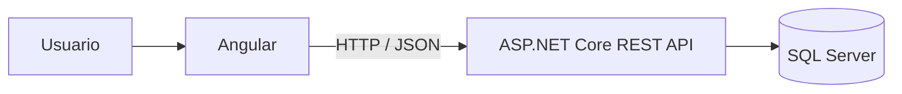

# TZISCA


**Proyecto académico · Diseño y documentación · Implementación pendiente**

[Documentación](docs/README.md) · [Diagramas](docs/diagramas/README.md) · [Vistas por rol](docs/vistas/README.md) · [Sprint 1](docs/planificacion/sprint-1.md)

Sistema Web de Reservas, Recomendación y Gestión de Cabinas para Spa.

TZISCA centraliza el catálogo de tratamientos, cabinas, disponibilidad, reservaciones, proveedores, pagos, devoluciones y operación general del spa en una sola plataforma.

---

## Arquitectura

Frontend: Angular  
Backend: ASP.NET Core REST API  
Base de datos: SQL Server



[Ver diagrama de arquitectura](docs/diagramas/arquitectura.md).

---

## Funcionalidades principales

Alcance documentado, pendiente de implementación.

- Registro e inicio de sesión.
- Control de acceso por roles.
- Catálogo de tratamientos.
- Catálogo de cabinas.
- Compatibilidad tratamiento-cabina.
- Recomendación de cabinas.
- Carrito de reservación.
- Consulta de disponibilidad.
- Bloqueos temporales.
- Reservaciones.
- Gestión de proveedores.
- Asignación y sustitución de proveedores.
- Pagos.
- Devoluciones.
- Cancelaciones.
- Historial y trazabilidad.
- Reportes básicos.

---

## Roles del sistema

| Rol | Función principal |
|---|---|
| Cliente | Consulta servicios, gestiona carrito, reserva, paga y consulta sus reservaciones |
| Administrador general | Administra usuarios, tratamientos, cabinas, proveedores, pagos, devoluciones y reportes |
| Recepción y cabinas | Gestiona agenda, disponibilidad, reservaciones manuales, bloqueos y cancelaciones |
| Proveedor de tratamiento | Consulta su agenda, registra indisponibilidad e inicia o completa atenciones |

---

## Flujo principal de reservación

Login → Catálogo → Detalle → Carrito → Número de personas → Recomendación de cabina → Selección de cabina → Fecha y hora → Validación de disponibilidad → Bloqueo temporal → Resumen → Reservación `EN_PROCESO` → Pago → Revalidación → Confirmación → Mis reservaciones

[Ver flujo en Mermaid](docs/diagramas/flujo-reservacion.md). La creación deja los tratamientos en `PENDIENTE`; la confirmación requiere el pago válido cuando corresponda y la disponibilidad revalidada.

---

## Tecnologías

| Área | Tecnología |
|---|---|
| Frontend | Angular |
| Backend | ASP.NET Core |
| API | REST / JSON |
| Base de datos | SQL Server |
| Control de versiones | Git / GitHub |

---

## Documentación

[Índice general de documentación](docs/README.md).

### General

- [Propuesta del proyecto](docs/propuesta/propuesta-proyecto.md)
- [Arquitectura general](docs/arquitectura/arquitectura-general.md)
- [Catálogo de cabinas](docs/catalogos/catalogo-cabinas.md)

### Funcional

- [Casos de uso](docs/casos-de-uso/casos-de-uso.md)
- [Criterios de aceptación](docs/criterios-aceptacion/criterios-aceptacion.md)
- [Reglas de negocio](docs/reglas-negocio/reglas-negocio.md)

### Técnica

- [Diseño de API REST](docs/api/diseno-api-rest.md)
- [Diccionario de datos](docs/modelo-datos/diccionario-datos.md)
- [Diagramas](docs/diagramas/README.md)
- [Vistas](docs/vistas/README.md)

### Planificación

- [Sprint 1](docs/planificacion/sprint-1.md)

---

## Estructura del repositorio

```text
TZISCA/
├── backend/
├── frontend/
├── database/
│   ├── migrations/
│   ├── scripts/
│   └── seed/
├── docs/
│   ├── propuesta/
│   ├── planificacion/
│   ├── catalogos/
│   ├── arquitectura/
│   ├── api/
│   ├── casos-de-uso/
│   ├── criterios-aceptacion/
│   ├── reglas-negocio/
│   ├── modelo-datos/
│   ├── diagramas/
│   ├── vistas/
│   │   ├── cliente/
│   │   ├── administrador/
│   │   ├── recepcion/
│   │   └── proveedor/
│   ├── screenshots/
│   │   └── thumbs/
│   └── assets/
├── tests/
├── README.md
└── .gitignore
```

`fuentes/` y `respaldo-md/` se conservan localmente y están ignoradas por Git.

## Galería visual

La portada es una ilustración conceptual creada localmente, no una captura de la aplicación. No hay screenshots reales todavía.

- [Inventario de vistas por rol](docs/vistas/README.md).
- [Convención de capturas y miniaturas](docs/screenshots/README.md).

## Diagramas

- [Arquitectura](docs/diagramas/arquitectura.md)
- [Flujo de reservación](docs/diagramas/flujo-reservacion.md)
- [Módulos de la API](docs/diagramas/modulos-api.md)
- [Estados de reservación y tratamientos](docs/diagramas/estados-reservacion.md)

---

## Estado actual

El repositorio se encuentra en etapa de preparación documental y estructuración técnica previa al desarrollo.

La documentación funcional y técnica se encuentra organizada en Markdown para facilitar su consulta directamente desde GitHub.

---

El Sprint 1 existe como archivo, pero está vacío y pendiente de planificación. Los diseños de vistas y las capturas reales también están pendientes.

## Decisiones pendientes

Antes de cerrar ciertos módulos todavía deben aprobarse algunos parámetros:

- Horario de apertura y cierre.
- Días laborables y no laborables.
- Duración de intervalos de agenda.
- Anticipación mínima y máxima de reservación.
- Duración del bloqueo temporal.
- Política de tolerancia.
- Política de cancelación.
- Condiciones de devolución.
- Fórmula del importe.
- Tratamiento económico del pago aprobado con disponibilidad perdida (DP-EC-02).
- Pasarela de pago.
- Mecanismo concreto de autenticación.
- Algoritmo determinista de recomendación.

---

## Proyecto académico

Proyecto desarrollado como parte de prácticas profesionales.

TZISCA busca servir como base funcional y técnica para una plataforma real de gestión de servicios de spa.
