# Diagramas técnicos

[Documentación](../README.md) · [Inicio](../../README.md)

Diagramas del diseño previsto de TZISCA: Mermaid existentes y exportaciones reales del FigJam. Las imágenes no son pantallas de la aplicación.

## Índice

| Diagrama | Tipo | Archivo |
|---|---|---|
| Arquitectura | Mermaid | [arquitectura.md](arquitectura.md) |
| Flujo de citas | Mermaid | [flujo-citas.md](flujo-citas.md) |
| Módulos de la API | Mermaid | [modulos-api.md](modulos-api.md) |
| Estados de cita | Mermaid | [estados-cita.md](estados-cita.md) |
| Casos de uso general | UML — casos de uso | [casos-uso-general.png](casos-uso-general.png) |
| Casos de uso — Cliente | UML — casos de uso | [casos-uso-cliente.png](casos-uso-cliente.png) |
| Casos de uso — Administrador general | UML — casos de uso | [casos-uso-administrador.png](casos-uso-administrador.png) |
| Casos de uso — Recepción y cabinas | UML — casos de uso | [casos-uso-recepcion.png](casos-uso-recepcion.png) |
| Casos de uso — Proveedor y automatizaciones | UML — casos de uso | [casos-uso-proveedor.png](casos-uso-proveedor.png) |
| Reservación del cliente | Flujo | [flujo-reservacion-figma.png](flujo-reservacion-figma.png) |
| Cancelación de tratamiento o reservación | Flujo | [flujo-cancelacion-figma.png](flujo-cancelacion-figma.png) |
| Indisponibilidad y sustitución de proveedor | Flujo | [flujo-sustitucion-proveedor-figma.png](flujo-sustitucion-proveedor-figma.png) |
| Reservación del cliente — carrito, ciclos y bloqueos | Secuencia | [secuencia-reservacion.png](secuencia-reservacion.png) |
| Cancelación de tratamiento o reservación | Secuencia | [secuencia-cancelacion.png](secuencia-cancelacion.png) |
| Indisponibilidad y sustitución de proveedor | Secuencia | [secuencia-sustitucion-proveedor.png](secuencia-sustitucion-proveedor.png) |
| Realizar pago y confirmar reservación | Secuencia | [secuencia-pago-confirmacion.png](secuencia-pago-confirmacion.png) |
| Cancelación y devolución | Secuencia | [secuencia-cancelacion-devolucion.png](secuencia-cancelacion-devolucion.png) |
| Arquitectura técnica de TZISCA | Arquitectura | [arquitectura-tecnica-figma.png](arquitectura-tecnica-figma.png) |
| Diagrama Entidad–Relación | Modelo de datos | [modelo-entidad-relacion-figma.png](modelo-entidad-relacion-figma.png) |
| Diagrama Entidad–Relación — Notación Chen | Modelo de datos | [modelo-entidad-relacion-chen-figjam.png](modelo-entidad-relacion-chen-figjam.png) |

[Origen, nodos y pendientes de extracción](origen-figma.md).

## Previews de Figma

Las miniaturas conservan la proporción. Abre cada imagen para consultar el diagrama completo.

### Casos de uso general

[Imagen completa](casos-uso-general.png) · [Nodo de referencia en FigJam](https://www.figma.com/board/kjk49fziEiQzOM85H3MqRy/Sin-t%C3%ADtulo?node-id=31-2858)

### Casos de uso — Cliente

<a href="casos-uso-cliente.png">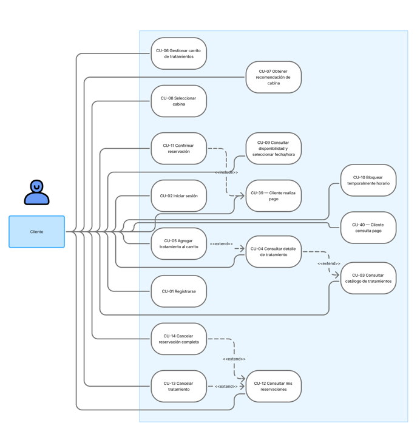</a>

[Imagen completa](casos-uso-cliente.png) · [Nodo de referencia en FigJam](https://www.figma.com/board/kjk49fziEiQzOM85H3MqRy/Sin-t%C3%ADtulo?node-id=31-2252)

### Casos de uso — Administrador general

<a href="casos-uso-administrador.png">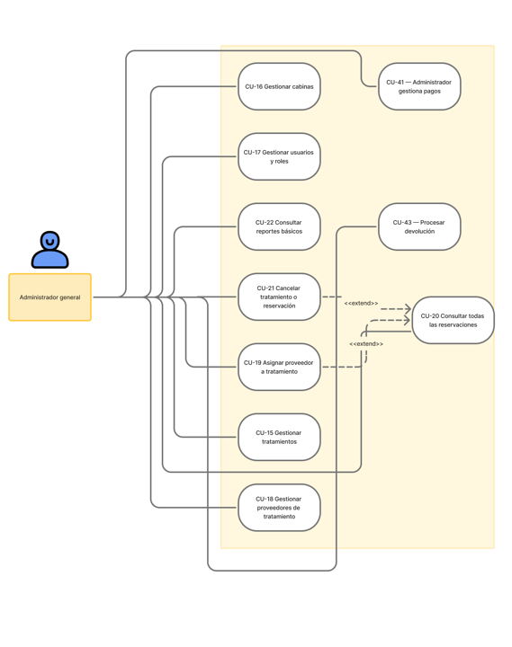</a>

[Imagen completa](casos-uso-administrador.png) · [Nodo de referencia en FigJam](https://www.figma.com/board/kjk49fziEiQzOM85H3MqRy/Sin-t%C3%ADtulo?node-id=31-2232)

### Casos de uso — Recepción y cabinas

<a href="casos-uso-recepcion.png">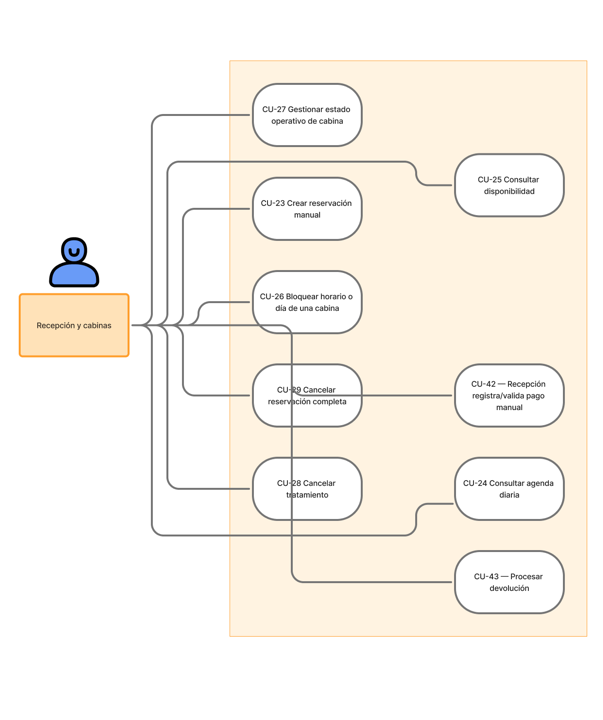</a>

[Imagen completa](casos-uso-recepcion.png) · [Nodo de referencia en FigJam](https://www.figma.com/board/kjk49fziEiQzOM85H3MqRy/Sin-t%C3%ADtulo?node-id=31-2286)

### Casos de uso — Proveedor y automatizaciones

<a href="casos-uso-proveedor.png">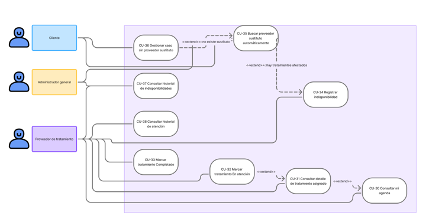</a>

[Imagen completa](casos-uso-proveedor.png) · [Nodo de referencia en FigJam](https://www.figma.com/board/kjk49fziEiQzOM85H3MqRy/Sin-t%C3%ADtulo?node-id=31-2304)

### Reservación del cliente

<a href="flujo-reservacion-figma.png">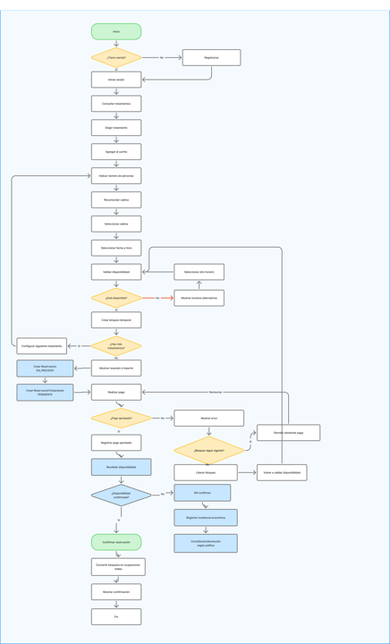</a>

[Imagen completa](flujo-reservacion-figma.png) · [Nodo de referencia en FigJam](https://www.figma.com/board/kjk49fziEiQzOM85H3MqRy/Sin-t%C3%ADtulo?node-id=32-507)

### Cancelación de tratamiento o reservación

<a href="flujo-cancelacion-figma.png">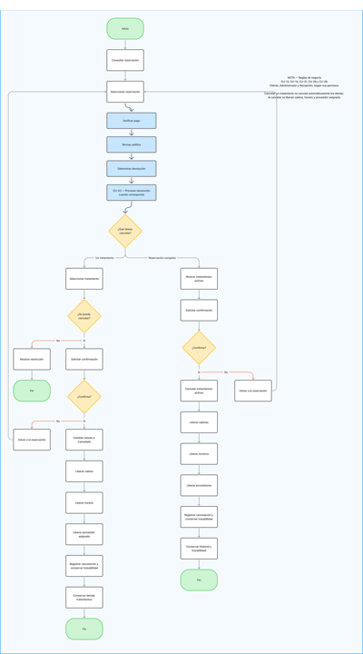</a>

[Imagen completa](flujo-cancelacion-figma.png) · [Nodo de referencia en FigJam](https://www.figma.com/board/kjk49fziEiQzOM85H3MqRy/Sin-t%C3%ADtulo?node-id=63-686)

### Indisponibilidad y sustitución de proveedor

<a href="flujo-sustitucion-proveedor-figma.png">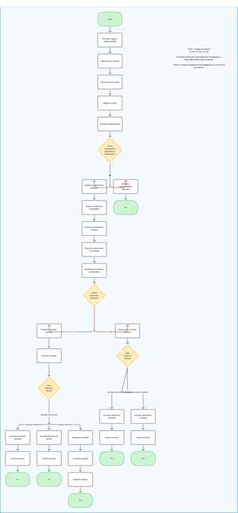</a>

[Imagen completa](flujo-sustitucion-proveedor-figma.png) · [Nodo de referencia en FigJam](https://www.figma.com/board/kjk49fziEiQzOM85H3MqRy/Sin-t%C3%ADtulo?node-id=64-855)

### Reservación del cliente — carrito, ciclos y bloqueos

<a href="secuencia-reservacion.png">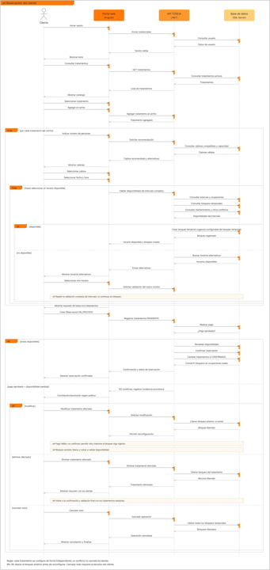</a>

[Imagen completa](secuencia-reservacion.png) · [Nodo de referencia en FigJam](https://www.figma.com/board/kjk49fziEiQzOM85H3MqRy/Sin-t%C3%ADtulo?node-id=126-1180)

### Cancelación de tratamiento o reservación

<a href="secuencia-cancelacion.png">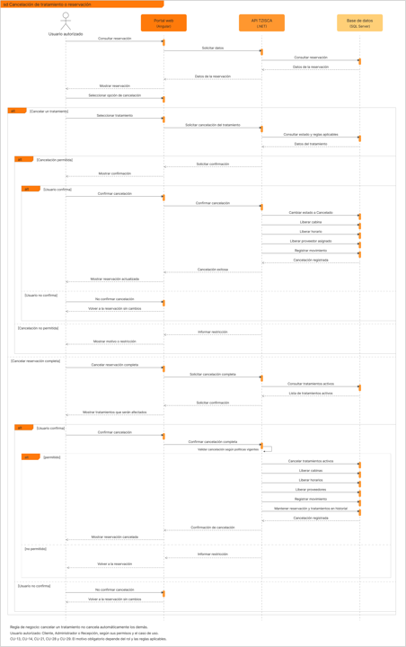</a>

[Imagen completa](secuencia-cancelacion.png) · [Nodo de referencia en FigJam](https://www.figma.com/board/kjk49fziEiQzOM85H3MqRy/Sin-t%C3%ADtulo?node-id=136-929)

### Indisponibilidad y sustitución de proveedor

<a href="secuencia-sustitucion-proveedor.png">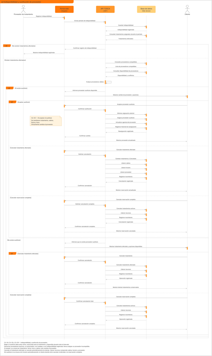</a>

[Imagen completa](secuencia-sustitucion-proveedor.png) · [Nodo de referencia en FigJam](https://www.figma.com/board/kjk49fziEiQzOM85H3MqRy/Sin-t%C3%ADtulo?node-id=146-929)

### Realizar pago y confirmar reservación

<a href="secuencia-pago-confirmacion.png">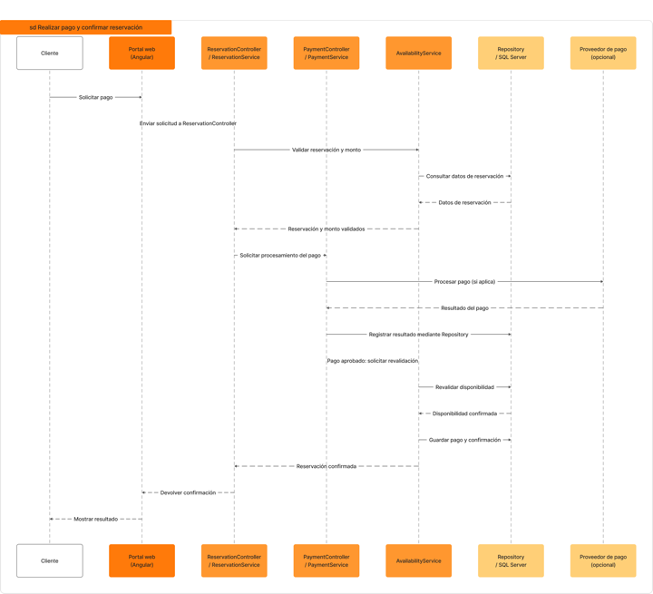</a>

[Imagen completa](secuencia-pago-confirmacion.png) · [Nodo de referencia en FigJam](https://www.figma.com/board/kjk49fziEiQzOM85H3MqRy/Sin-t%C3%ADtulo?node-id=298-1894)

### Cancelación y devolución

<a href="secuencia-cancelacion-devolucion.png">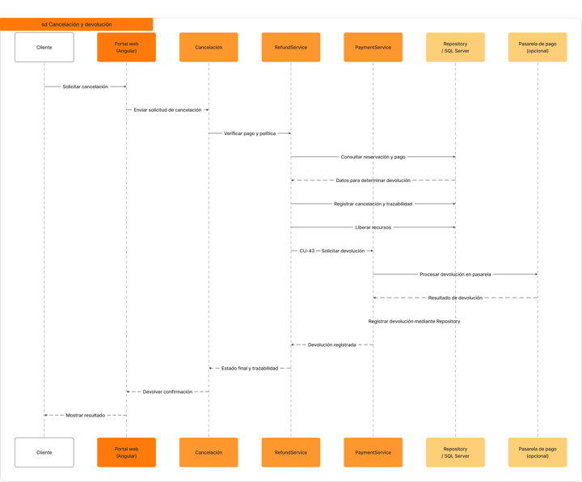</a>

[Imagen completa](secuencia-cancelacion-devolucion.png) · [Nodo de referencia en FigJam](https://www.figma.com/board/kjk49fziEiQzOM85H3MqRy/Sin-t%C3%ADtulo?node-id=299-1994)

### Arquitectura técnica de TZISCA

<a href="arquitectura-tecnica-figma.png">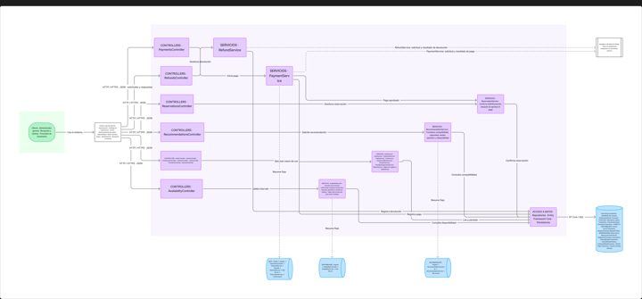</a>

[Imagen completa](arquitectura-tecnica-figma.png) · [Nodo de referencia en FigJam](https://www.figma.com/board/kjk49fziEiQzOM85H3MqRy/Sin-t%C3%ADtulo?node-id=302-2088)

### Diagrama Entidad–Relación

[Imagen completa](modelo-entidad-relacion-figma.png) · [Nodo de referencia en FigJam](https://www.figma.com/board/kjk49fziEiQzOM85H3MqRy/Sin-t%C3%ADtulo?node-id=192-929)

### Diagrama Entidad–Relación — Notación Chen

[Imagen completa](modelo-entidad-relacion-chen-figjam.png) · [Sección de FigJam](https://www.figma.com/board/kjk49fziEiQzOM85H3MqRy/Sin-t%C3%ADtulo?node-id=381-2299)

> Las exportaciones ER deben reflejar el modelo canónico de 22 entidades definido en el [diccionario de datos](../modelo-datos/diccionario-datos.md). El FigJam se actualiza directamente y las PNG se sustituyen por sus exportaciones integradas, no por versiones “corregidas” separadas.
