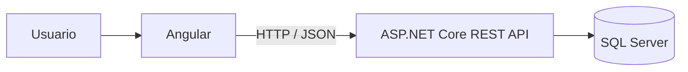

# Arquitectura

[Índice de diagramas](README.md) · [Documentación](../README.md)

Arquitectura prevista; la lógica de negocio y la validación de disponibilidad residen en el backend.

Fuente: [Arquitectura general](../arquitectura/arquitectura-general.md).
