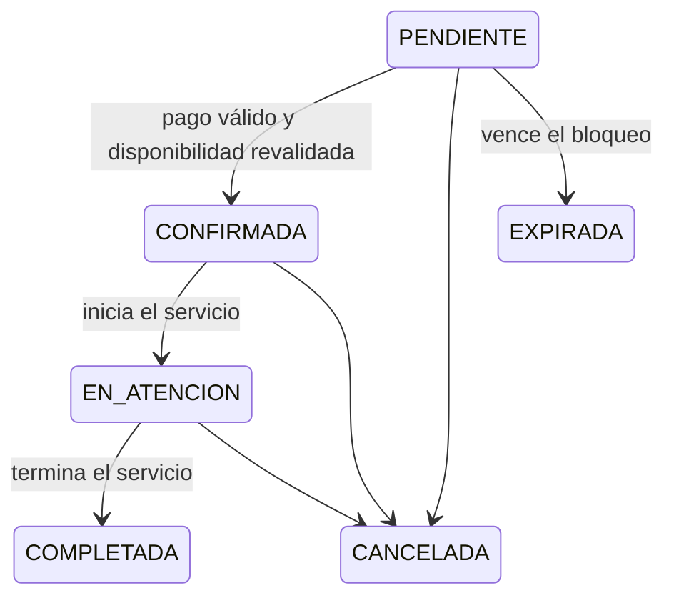

# Estados de cita

Propuesta de corrección local de `docs/diagramas/estados-cita.md`.

Estados oficiales: `PENDIENTE`, `CONFIRMADA`, `EN_ATENCION`, `COMPLETADA`, `CANCELADA` y `EXPIRADA`.

De acuerdo con RN-42 a RN-45, una Cita cancelada o expirada no puede pasar a `EN_ATENCION` ni a `COMPLETADA`; una Cita confirmada puede iniciar atención y una Cita en atención puede completarse. Se corrigió `COMPLETADO` por `COMPLETADA`.
