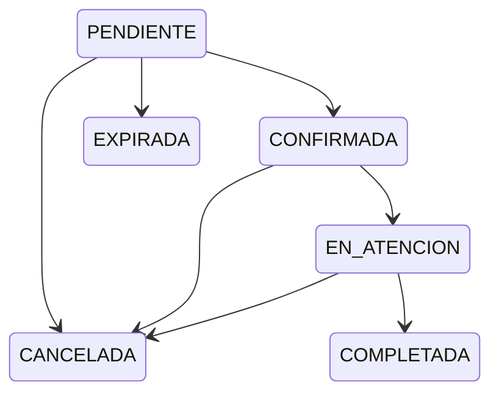

# Estados de cita

[Índice de diagramas](README.md) · [Documentación](../README.md)

## Cita

Se muestran las transiciones principales documentadas para la entidad Cita. Los estados oficiales son `PENDIENTE`, `CONFIRMADA`, `EN_ATENCION`, `COMPLETADA`, `CANCELADA` y `EXPIRADA`. Una Cita representa exactamente un tratamiento programado para un Cliente; no existe una entidad técnica llamada Reservacion.

Referencia: [Diccionario de datos](../modelo-datos/diccionario-datos.md) y [reglas de negocio](../reglas-negocio/reglas-negocio.md).
