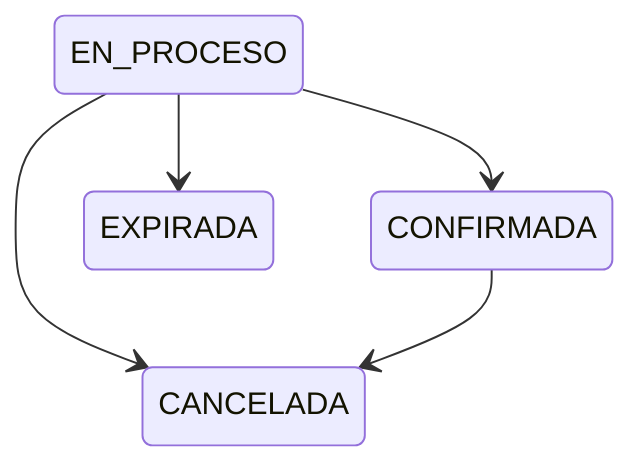
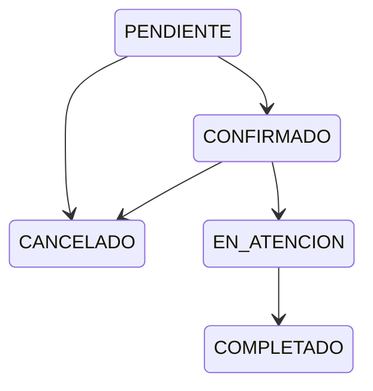

# Estados de reservación

[Índice de diagramas](README.md) · [Documentación](../README.md)

## Reservacion

## ReservacionTratamiento

Se muestran únicamente las transiciones principales solicitadas, sin añadir estados iniciales o finales. Los ciclos del encabezado y de cada tratamiento se presentan por separado.

Referencia: [Diccionario de datos](../modelo-datos/diccionario-datos.md) y [reglas de negocio](../reglas-negocio/reglas-negocio.md).
