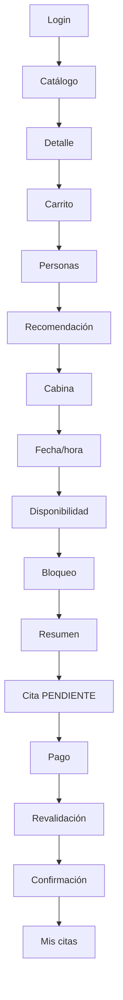

# Flujo principal de citas

[Índice de diagramas](README.md) · [Documentación](../README.md)

Representa el camino exitoso, no las alternativas de error. El Carrito puede originar una o varias Citas; cada Cita nace en `PENDIENTE` y conserva su propio bloqueo temporal. La confirmación requiere validar el pago exigible, su importe, los recursos y la disponibilidad; entonces la Cita pasa a `CONFIRMADA`. Si un Pago queda `PAGADO` pero se pierde la disponibilidad, la Cita no se confirma y se inicia la devolución aplicable, conforme a RN-81.

Fuente: [Diseño de API REST](../api/diseno-api-rest.md).
