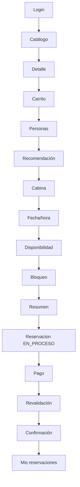

# Flujo principal de reservación

[Índice de diagramas](README.md) · [Documentación](../README.md)

Representa el camino exitoso, no las alternativas de error. Al crear la reservación, sus tratamientos quedan en `PENDIENTE`. La confirmación requiere validar el pago requerido, su pertenencia e importe, los bloqueos y la disponibilidad; entonces la reservación pasa a `CONFIRMADA` y sus tratamientos válidos a `CONFIRMADO`. Un pago aprobado con disponibilidad perdida no confirma la reservación ni genera una devolución automática, conforme a DP-EC-02 (RN-105): el Cliente elige entre otra cabina/horario, devolución parcial del tratamiento afectado o cancelación con devolución total.

Fuente: [Diseño de API REST](../api/diseno-api-rest.md).
