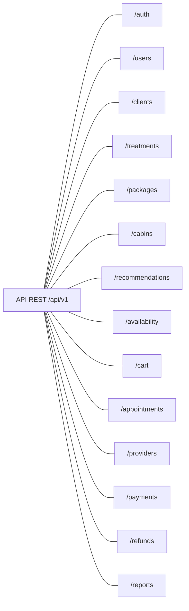

# Módulos de la API

Propuesta de corrección local de `docs/diagramas/modulos-api.md`.

Las líneas indican pertenencia al contrato API, no dependencias ni orden de ejecución. El contrato vigente usa la base `/api/v1`, contiene 14 módulos y 68 endpoints, conforme a `docs/api/diseno-api-rest.md`.

Cambios propuestos: se sustituyen `/temporary-blocks`, `/reservations` y `/provider-assignments` por `/clients`, `/packages` y `/appointments`. El bloqueo temporal y las asignaciones de proveedor son comportamientos de los recursos vigentes; no son módulos independientes.
