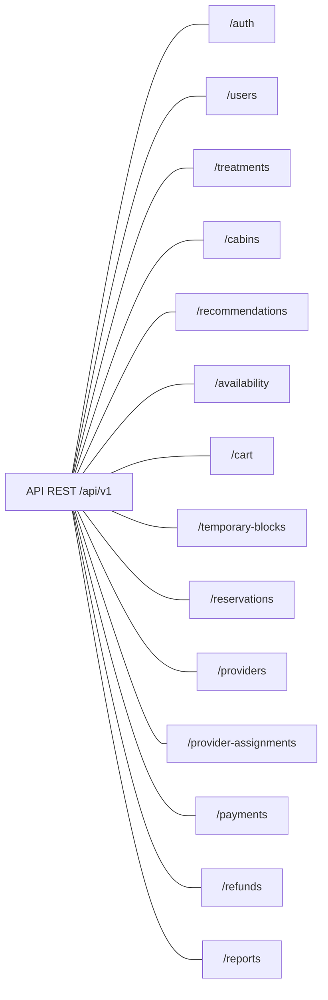

# Módulos de la API

[Índice de diagramas](README.md) · [Documentación](../README.md)

Las líneas indican pertenencia al contrato API, no dependencias ni orden de ejecución. Los 14 módulos corresponden al [Diseño de API REST](../api/diseno-api-rest.md); los endpoints, permisos y DTO se consultan en ese documento.
